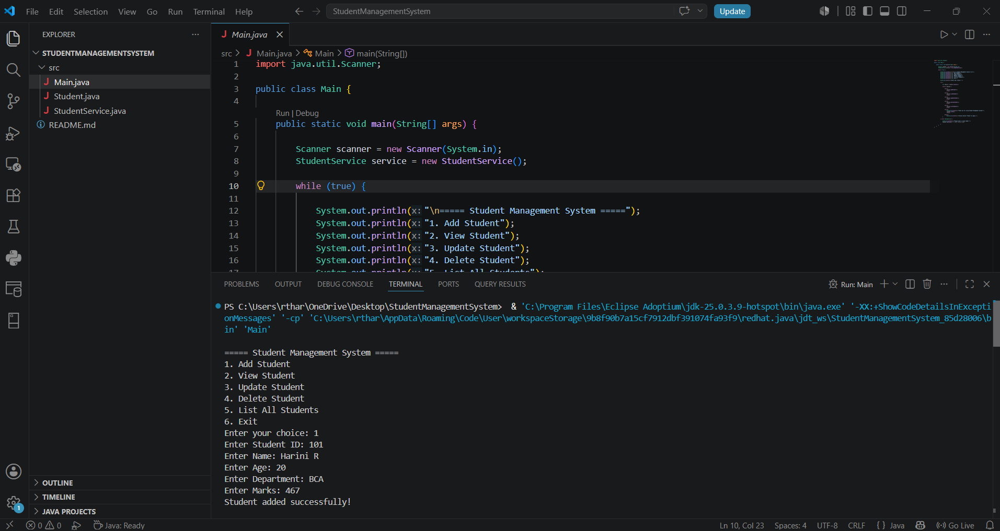
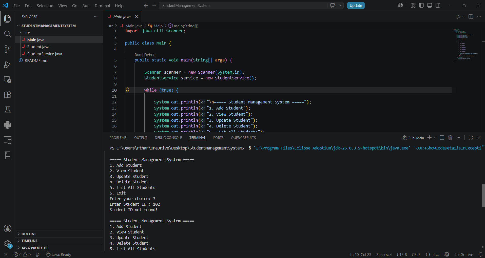
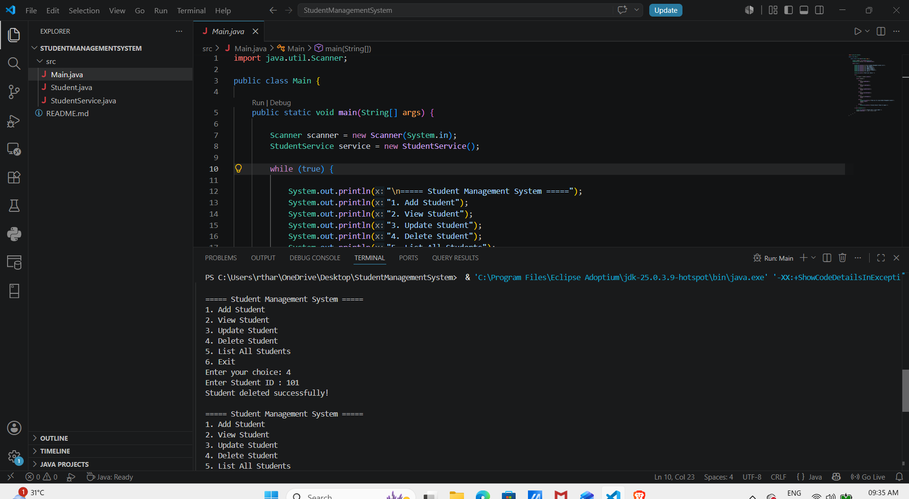
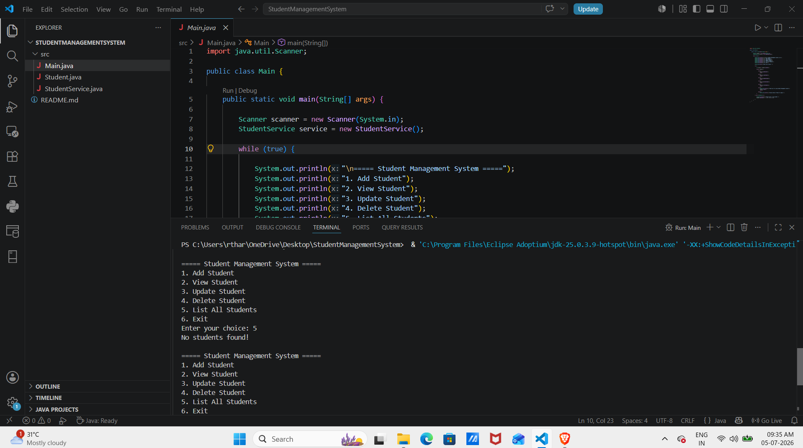
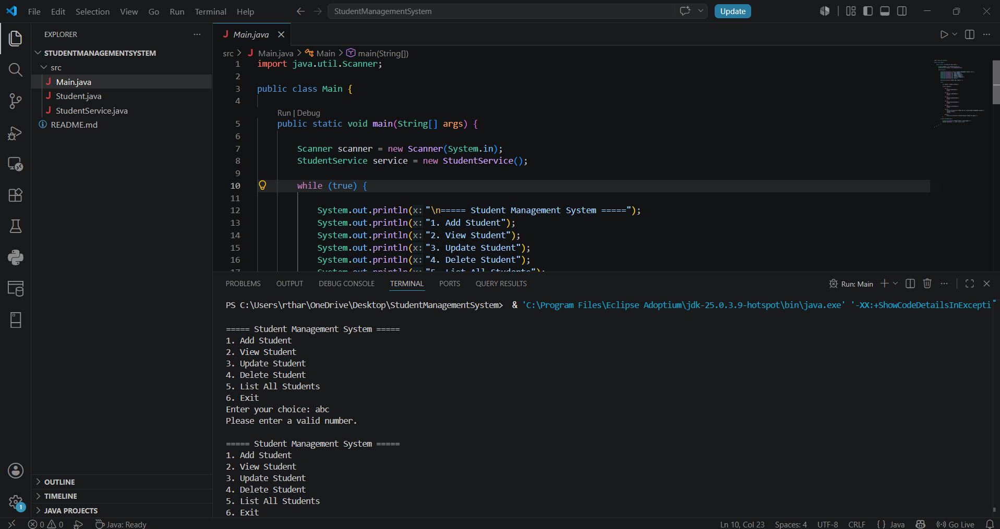
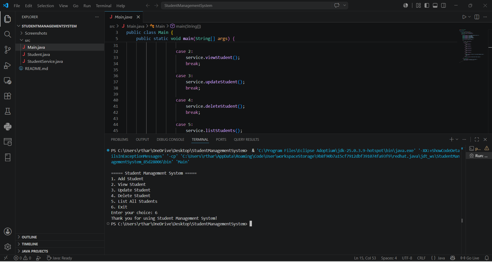

# Student Management System

A simple console-based **Student Management System** built in Java. It lets you add, view, update, delete, and list students using an in-memory `HashMap` for storage.

## Features

- **Add Student** — Add a new student with ID, name, age, department, and marks
- **View Student** — Look up a student's details by ID
- **Update Student** — Edit an existing student's information (press Enter to keep current value)
- **Delete Student** — Remove a student by ID
- **List All Students** — Display all stored students

## Project Structure

```
.
├── Main.java             # Entry point with the menu-driven CLI loop
├── Student.java          # Student model (POJO) with getters/setters and toString()
└── StudentService.java   # Business logic: add, view, update, delete, list students
```

## Requirements

- Java Development Kit (JDK) 8 or higher

## How to Compile and Run

1. Place all three files (`Main.java`, `Student.java`, `StudentService.java`) in the same directory.
2. Compile:
   ```bash
   javac *.java
   ```
3. Run:
   ```bash
   java Main
   ```

## Usage

On running the program, you'll see a menu:

```
===== Student Management System =====
1. Add Student
2. View Student
3. Update Student
4. Delete Student
5. List All Students
6. Exit
Enter your choice:
```

Enter the number corresponding to the action you want to perform, and follow the prompts.

## Data Model

Each student record includes:

| Field      | Type   | Description              |
|------------|--------|---------------------------|
| id         | int    | Unique student identifier |
| name       | String | Student's full name       |
| age        | int    | Student's age              |
| department | String | Department name            |
| marks      | double | Student's marks             |

## Console Output Screenshots

### Add Student


### View Student


### Update Student


### Delete Student


### List All Students


### Input Validation


### Exit


## Notes

- Data is stored **in memory only** — all records are lost when the program exits (no database or file persistence).
- Student IDs must be unique; attempting to add a duplicate ID will be rejected.
- Invalid menu input (non-numeric) is handled gracefully with an error message.

## Possible Improvements

- Persist data to a file or database
- Add input validation (e.g., negative age, marks out of range)
- Add search by name or department
- Unit tests for `StudentService`
